## CAMPUSSHOP E-COMMERCE

Bienvenido a la documentación de **CampusShop**, la maquetación web de la interfaz frontal para un E-Commerce académico enfocado en la compra y venta de productos en el entorno universitario. Este proyecto replica con precisión la estética y experiencia *mobile-first* definida en los mockups y wireframe oficiales.

## ESTRUCTURA DE ARCHIVOS

CampusShop/
 ├── index.html. # [Home / Inicio](Index.html): Pantalla principal con buscador, categorías y productos destacados.
 ├── catalogo.html #  [Catálogo](Index.html): Malla responsive de productos con filtros visuales.
 ├── producto.html # [Detalle de Producto](Airpods.html): Vista de producto con imágenes, características, selección de opciones y relacionados.
 ├── carrito.html # [Carrito de Compras](carritolleno.html): Resumen visual de artículos seleccionados y desglose de costos.
 ├── checkout.html # [Checkout](checkout.html): Formulario de compra, datos de envío y resumen de orden.
 ├── perfil.html # [Perfil de Usuario](perfil.html): Información de la cuenta, configuraciones y accesos directos.
 ├── historial.html # [Historial de Pedidos](historiallleno.html): Listado y estado de compras anteriores.
 ├── vacio.html # [Estado Vacío / Error](vacio.html): Pantalla de retorno con ilustración y guía al catálogo.
 ├── css/
 │    ├── base.css
 │    ├── layout.css
 │    ├── components.css
 │    └── responsive.css
 └── img/
      └── (imágenes de productos)

## ARQUITECTURA Y TECNOLOGIAS

El desarrollo fue construido respetando estrictamente los requisitos técnicos solicitados:

* **HTML5 Semántico**: Uso correcto de etiquetas de estructura (`header`, `nav`, `main`, `section`, `article`, `footer`).
* **CSS3 Puro**: Estilos modulares sin uso de preprocesadores, librerías o frameworks externos.
* **Diseño Mobile-First**: Adaptación progresiva mediante Media Queries para móviles, tablets y computadoras.
* **Sin JavaScript**: Interacciones visuales y estados simulados mediante pseudo-clases y transiciones CSS (`:hover`, `:checked`).

## COMÓ PROBAR EL CODIGO

* En VS CODE haz click derecho en index y oprime Open With Live Server

|                     Maqueta                     |                    Resultado                    |
| :----------------------------------------------: | :----------------------------------------------: |
| 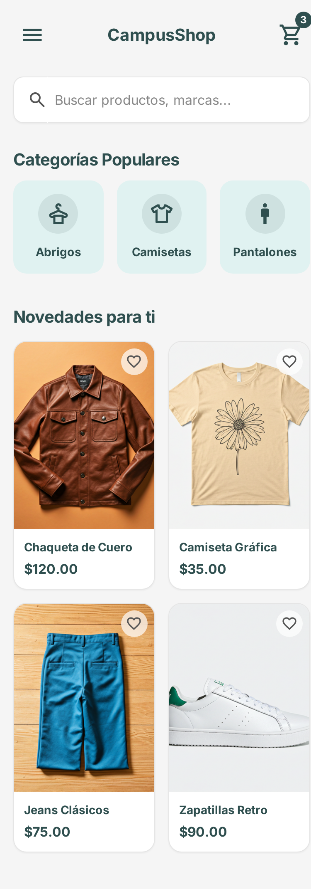 | 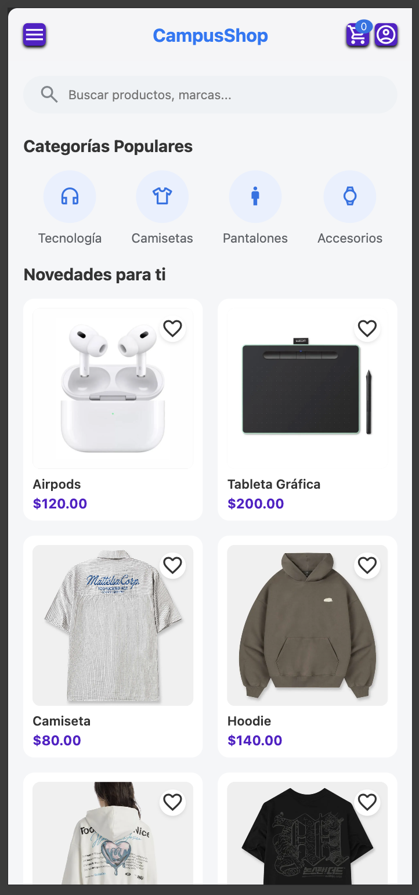 |
| 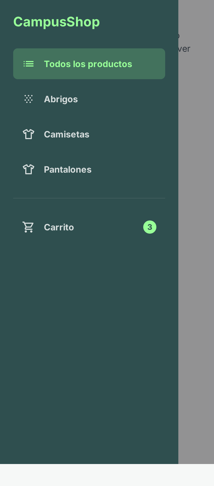 | 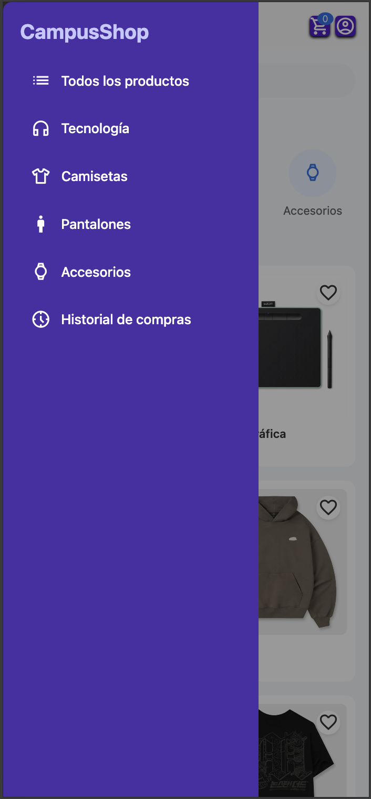 |
| 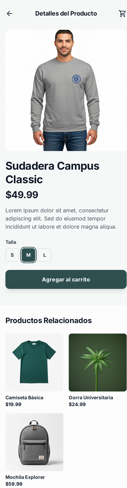 | 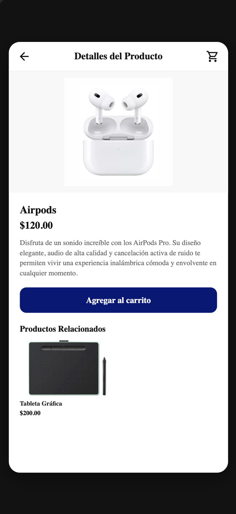 |
| 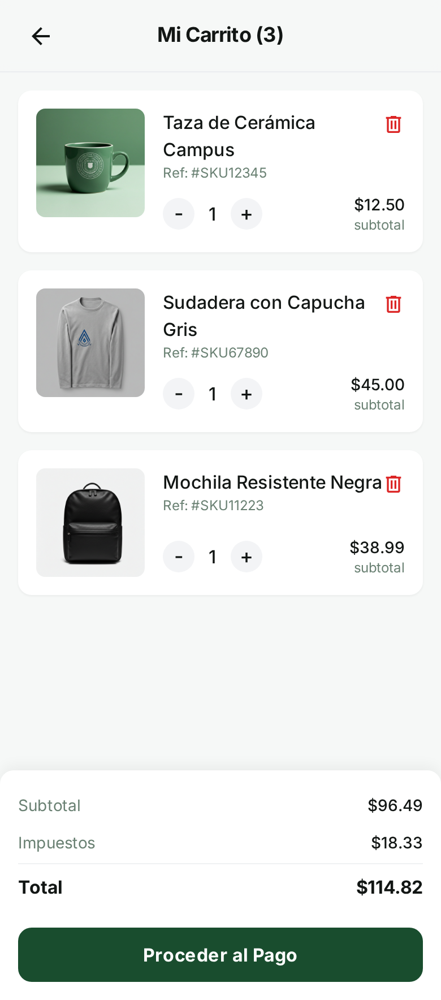 | 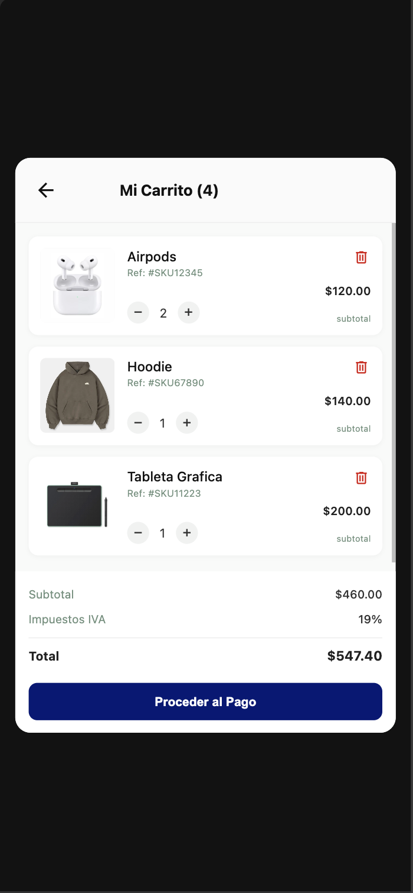 |
| 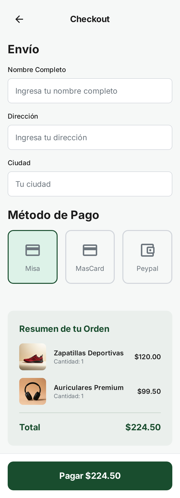 | 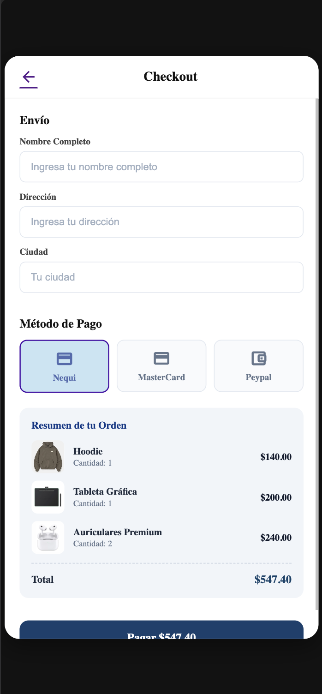 |
| 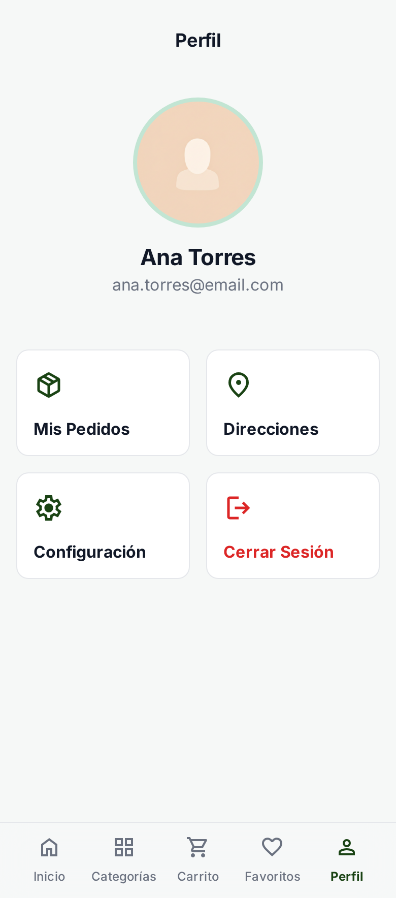 | 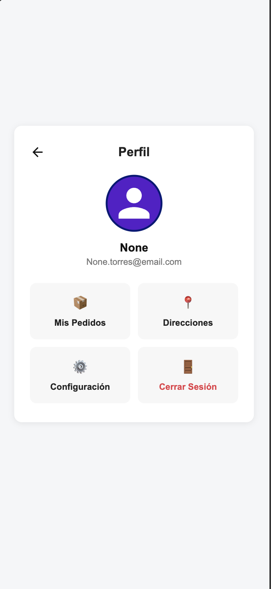 |
| 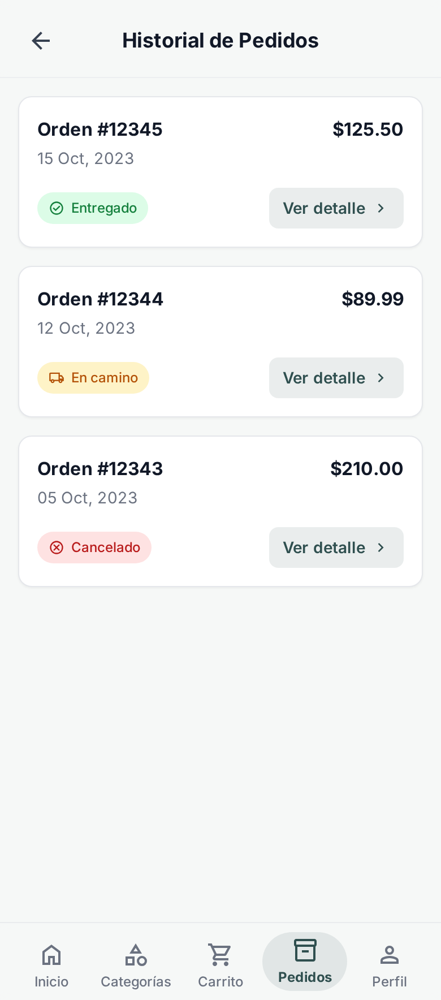 | 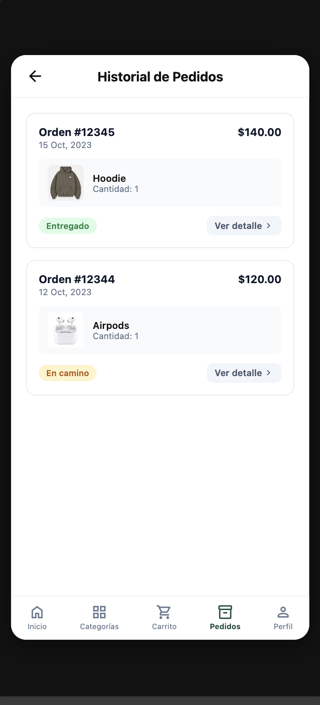 |
| 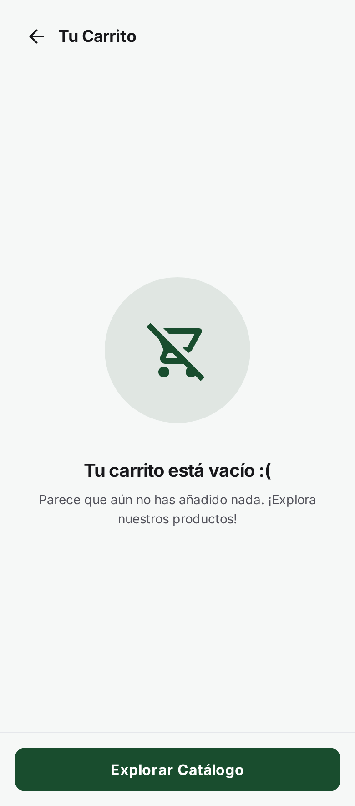 | 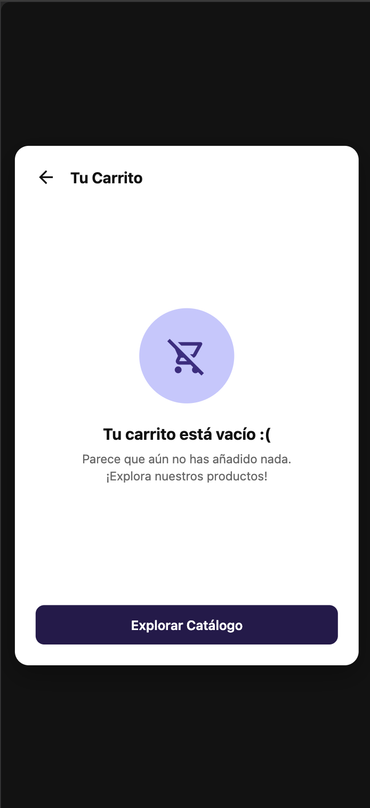 |
